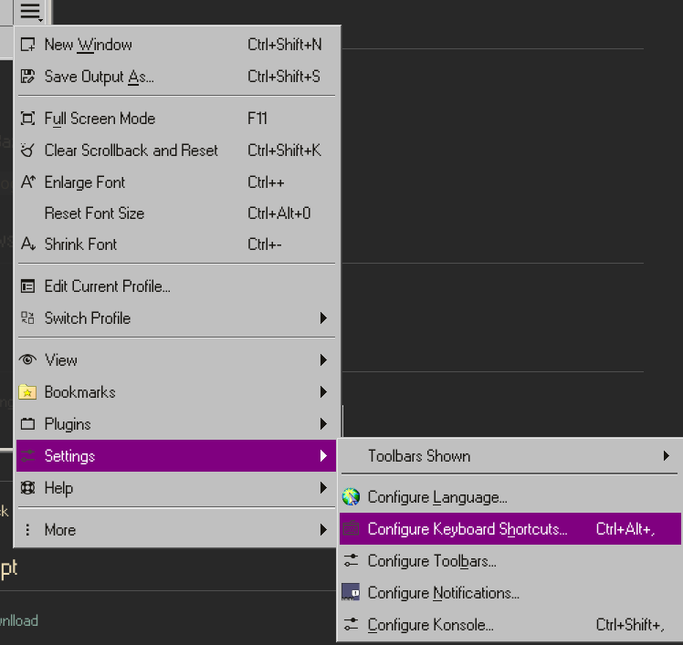

# Bazzite Laptop Setup Guide
## CTRL + ALT Swap (MacOS Layout)
Open 'Input Remapper' 
- Devices Tab -> Select 'AT Translate Set 2 keyboard' (or your keyboard name)
- Editor Tab
- Rename -> "CTRL + ALT Swap"
- +Add -> Record Button -> Press Alt
- Target -> Keyboard
- Type 'Control_L'
- Repeat with Ctrl
- Turn on `Autoload`
- Press save icon

## Software Center
- Bitwarden
- Thunderbird
- Konsole
- Moonlight
- Parsec
- Space Cadet Pinball
- Solitaire
- KMines

## VSCodium
[https://vscodium.com/](https://vscodium.com/)

## Icons
```bash
cd  ~/.local/share/icons/
git clone https://github.com/Stanton731/Memphis98
```
### Edit an icon
```bash
cd ~/Desktop
sudo nano org.mozilla.firefox.desktop
killall -SIGUSR1 plasmashell
```
or 
right click -> Open with... -> VSCodium

### Add Trash Icon 
for trash icon:
```
sudo nano ~/Desktop/trash.desktop
```
paste this, save and exit nano:
```
[Desktop Entry]
Name=Trash
Comment=Contains removed files
Icon=user-trash-full
EmptyIcon=user-trash
Type=Link
URL=trash:/
OnlyShowIn=KDE;
```
### Add Computer Icon
for computer icon:
```
sudo nano ~/Desktop/computer.desktop
```
paste this, save and exit nano:
```
[Desktop Entry]
Comment=
Icon=computer 
Name[en_US]=computer
Name=computer
OnlyShowIn=KDE;
Type=Link
URL[$e]=file:///
```

## Screenshots
- Spectacle comes pre-installed

## Konsole
### Shortcuts


### Turn off Bazzite welcome screen:
`ujust toggle-user-motd`

## Windows 98 look
[CLICK](https://www.reddit.com/r/unixporn/comments/11britw/kde_went_full_on_classic_windows_style/#lightbox)

## Steam
-> Right Click Game -> `Properties` -> `Compatibility` -> Checkbox `Force`

## Veracrypt
[Fedora Downlload](https://www.veracrypt.fr/en/Downloads.html)

## Install package on fedora
`sudo dnf install  ./package.rpm`

## Photopea:
[https://gitflic.ru/project/photopea-v2/photopea-v-2.git](https://gitflic.ru/project/photopea-v2/photopea-v-2.git)
```bash
git clone https://gitflic.ru/project/photopea-v2/photopea-v-2.git
python Updater.py --fonts
```


## Docker
[https://docs.docker.com/engine/install/fedora/](https://docs.docker.com/engine/install/fedora/)
restart after installation:
```bash
shutdown -r now
```

### Docker Compose / Docker Desktop
[https://docs.docker.com/desktop/setup/install/linux/fedora/](https://docs.docker.com/desktop/setup/install/linux/fedora/)
```bash
docker compose version
#NOT NOT NOT docker-compose
```

## Node
```bash
 sudo dnf install nodejs
```

## LACT (fan control) (did not work)
```
 ujust install-lact 
```
## Waydroid
```
ujust setup-waydroid
```
[https://docs.waydro.id/faq/google-play-certification](https://docs.waydro.id/faq/google-play-certification)

## Screen Lock Graphics:


## Xbox One S Controller
1. Log into windows machine
2. Download Xbox Accessories from MS Store.
3. Update Controller (DO NOT UNPLUG.)
4. Back in Bazzite try pairing.

## Bugs
- Changing other resolutions beside 1920x1080. Black Screen.
- Log Out not working