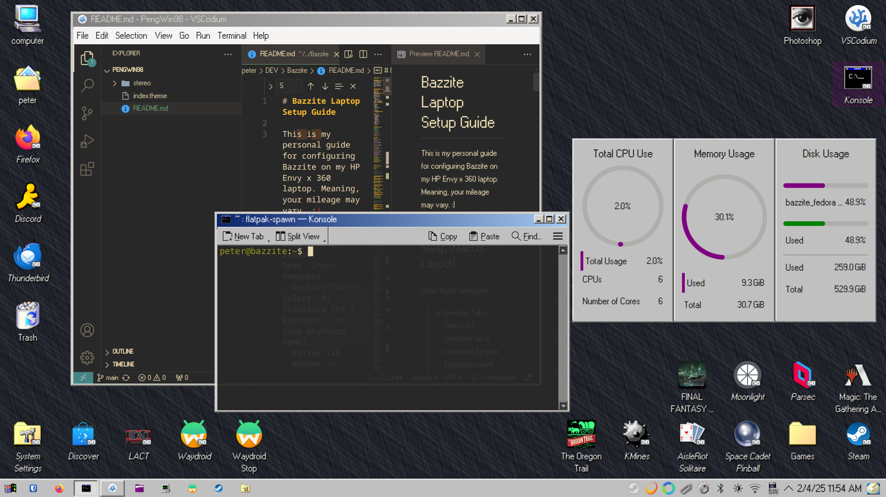
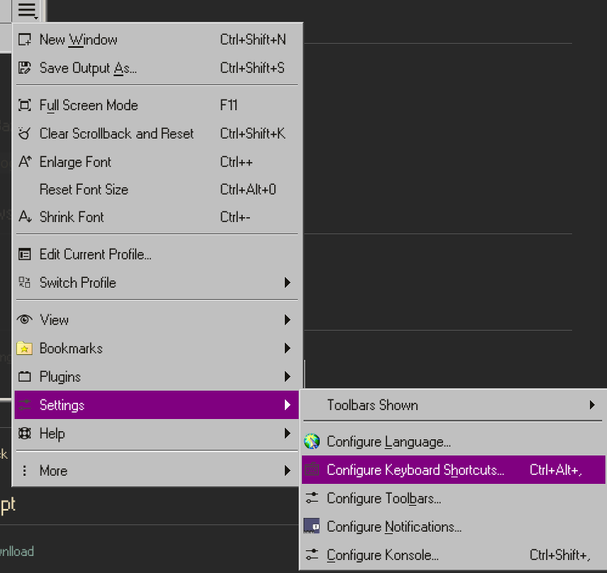
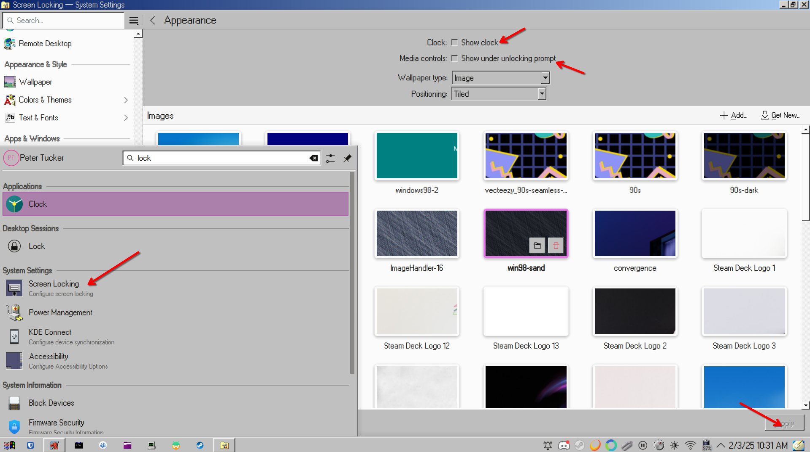

# Bazzite Laptop Setup Guide

This is my personal guide for configuring Bazzite on my HP Envy x 360 laptop. Meaning, your mileage may vary. :)


## CTRL + ALT Swap (MacOS Layout)
Open 'Input Remapper' 
- Devices Tab -> Select 'AT Translate Set 2 keyboard' (or your keyboard name)
- Editor Tab
- Rename -> "CTRL + ALT Swap"
- +Add -> Record Button -> Press Alt
- Target -> Keyboard
- Type 'Control_L'
- Repeat with Ctrl
- Turn on `Autoload`
- Press save icon

## Software Center
- Bitwarden
- Thunderbird
- Anydesk
- Konsole
- Blender
- Moonlight
- Parsec
- Space Cadet Pinball
- Solitaire
- KMines

## Install package on Fedora
`sudo dnf install ./package.rpm`

## VSCodium
[https://vscodium.com/](https://vscodium.com/)

## DaVinci Resolve
[DaVinci Resolve Setup Guide](https://universal-blue.discourse.group/t/davinci-resolve-setup-guide/1197)

## Photopea
[https://gitflic.ru/project/photopea-v2/photopea-v-2.git](https://gitflic.ru/project/photopea-v2/photopea-v-2.git)
```bash
git clone https://gitflic.ru/project/photopea-v2/photopea-v-2.git
python Updater.py --fonts
```

## Helpful `.bashrc` commands:
```bash
sudo nano ~/.bashrc
```
```bash
# ----------------DOCKER------------------------

alias down='sudo docker compose down'
alias up='sudo docker compose up'
alias upf='sudo docker compose up --force-recreate'
alias build='sudo docker compose build'
alias buildnc='sudo docker compose build --no-cache'
alias dsize='sudo docker images --format "{{.Repository}}:{{.Tag}} {{.Size}}" | sort -h -k2'

# ----------------CODE------------------------

alias DEV='cd ~/DEV'
alias dev='cd ~/DEV'
alias code='codium' 
```

## Icons
```bash
cd  ~/.local/share/icons/
git clone https://github.com/Stanton731/Memphis98
```
### Edit an icon
```bash
cd ~/Desktop
sudo nano org.mozilla.firefox.desktop
killall -SIGUSR1 plasmashell
```
or 
right-click -> Open with... -> VSCodium

### Add Trash Icon
For trash icon:
```bash
sudo nano ~/Desktop/trash.desktop
```
Paste this, save, and exit nano:
```ini
[Desktop Entry]
Name=Trash
Comment=Contains removed files
Icon=user-trash-full
EmptyIcon=user-trash
Type=Link
URL=trash:/
OnlyShowIn=KDE;
```

### Add Computer Icon
For computer icon:
```bash
sudo nano ~/Desktop/computer.desktop
```
Paste this, save, and exit nano:
```ini
[Desktop Entry]
Comment=
Icon=computer 
Name[en_US]=computer
Name=computer
OnlyShowIn=KDE;
Type=Link
URL[$e]=file:///
```

## Windows 98 Look
[Classic Windows Style](https://www.reddit.com/r/unixporn/comments/11britw/kde_went_full_on_classic_windows_style/#lightbox)

## Windows 98/95/KidPix/AIM Sounds
[PengWin98 Sound Pack](https://github.com/hidmush86/PengWin98)

## Konsole
### Edit Shortcuts:


### Turn off Bazzite welcome screen:
`ujust toggle-user-motd`

## Steam
Right Click Game -> `Properties` -> `Compatibility` -> Checkbox `Force`

## Xbox One S Controller Not Working Fix (Update Controller)
1. Log into Windows machine
2. Download Xbox Accessories from MS Store.
3. Update Controller (DO NOT UNPLUG.)
4. Back in Bazzite, try pairing.

## Veracrypt
[Fedora Download](https://www.veracrypt.fr/en/Downloads.html)

## Install Docker
```bash
ujust install-docker
systemctl reboot 
# not sure if this installs 'docker compose' or not.
``` 

### Install docker-compose (not sure if needed)
```
sudo rpm-ostree override replace docker-compose
systemctl reboot
```

### Permanently Allow Docker Access to the Mounted Directory
If a Docker container fails to access a mounted directory due to **SELinux restrictions**, follow these steps to resolve the issue.
Apply the correct security context to the mounted directory:
```bash
sudo chcon -R -t svirt_sandbox_file_t <PATH_TO_MOUNTED_DOCKER_FOLDER>
docker-compose down
docker-compose up
# check if the container is working correctly now
```

## Waydroid
```
ujust setup-waydroid
```
[Waydroid Play Certification](https://docs.waydro.id/faq/google-play-certification)

## Node (npm, npx)
```bash
sudo dnf install nodejs
```

## Screenshots
- Spectacle comes pre-installed

## LACT (Fan Control) (Did Not Work)
```bash
ujust install-lact 
```

## Information about rpm-ostree
```bash
rpm-ostree status
```

## Screen Lock Graphics


## Bugs
- Changing other resolutions besides 1920x1080. Black Screen.
- Log Out not working
- Synergy Symless works but is pretty glitchy.
- LACT does not see fans.
